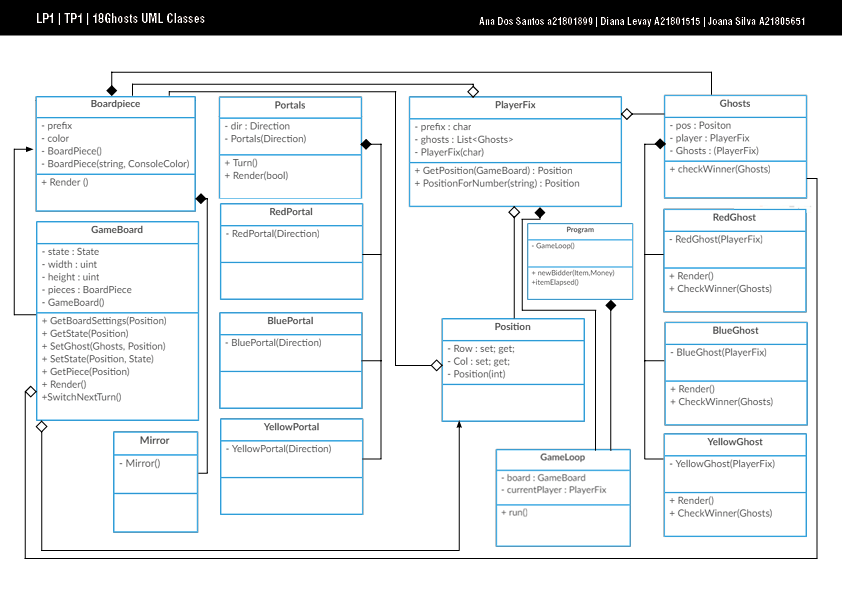
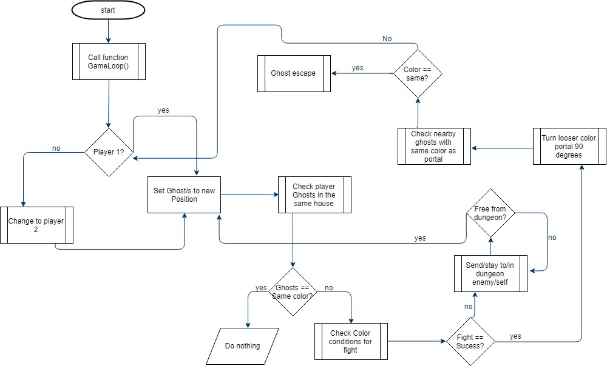

# 18Ghosts

## Authors

**Ana Santos** a21801899, [AnSantos99](https://github.com/AnSantos99) 
**Diana Levay** a21801515, [nanilevay](https://github.com/nanilevay) 
**Joana Silva** a21805651, [LegendaryBananaCat](https://github.com/LegendaryBananaCat)

## Repositório no Github

[GitHub](https://github.com/AnSantos99/lp1_18ghosts)

## Assignments

**Code:**
* Diana: logic and definition of the classes, game board definition, portal logic, dungeon
* Ana: player movements and assignment of variables, mirror logic
* Joana: player colour battles, gameloop and winning condition logic
* there were some issues with merge conflicts and github during the development, so not every change was immediately committed and some code was shared via ZIP downloads, so sometimes a commit will have a lot of new information

## Solution

Initially we struggled with trying to create our program using object oriented programming, so we had to check some programs made my other people (see references). 
Afterwards we referenced the Tic Tac Toe board from the book in the references.
Later we updated our solution to introduce movement and started adding other classes from there. 
The program works by running the `Program.cs` file inside the folder `Project1`, the program will call a class called `GameLoop`, that then proceeds to render a 5*5 board with coordinates for positions and different corridor types (red, blue, yellow, portal, mirror)
There is a class for the board, player, ghosts, mirrors, portals, positions and game loop, that all reference each other to get and set positions and to ask for inputs and outputs. 
There is an enum for the board symbols and another one for the portal directions.

=======
Initially we struggled with trying to create our program using object oriented programming, so we had to check some programs made my other people (see references).
Afterwards we referenced the Tic Tac Toe board from the book in the references
Later we updated our solution to introduce movement and started adding other classes from there
The program works by running the `Program.cs` file inside the folder `Project1`, the program will call a class called `GameLoop`, that then proceeds to render a 5*5 board with coordinates for positions and different corridor types (red, blue, yellow, portal, mirror)
There is a class for the board, player, ghosts, mirrors, portals, positions and game loop, that all reference each other to get and set positions and to ask for inputs and outputs.
There is an enum for the board symbols and another one for the portal directions.

 

## Conclusion

To conclude it’s relevant to emphasize the importance of creating this project in the applied consolidation of the knowledge acquired during the c# lectures in a real situation. 

It was possible to deepen our knowledge about the usage of different variable types, Enums, Classes, Methods and training the use of good practices within the creation of code, commenting and organizing everything according to the needs that came along developing the project.

## References

Book Whitaker, R. B. (2016).  The C# Player's Guide (3rd Edition). Starbound Software. page 123
http://www.codinghomework.com/c-program-almost-chess-part-18-introduction-project/   
=======
Book Whitaker, R. B. (2016).  The C# Player's Guide (3rd Edition). Starbound Software. page 123 
http://www.codinghomework.com/c-program-almost-chess-part-18-introduction-project/  

Code was developed with the help of our colleague: **João Moreira - 21801608**, who is not currently doing this UC, but is knowledgeable in the field and was able to help guide us in the right direction with our program
There were idea exchanges with some of the other groups doing the project
